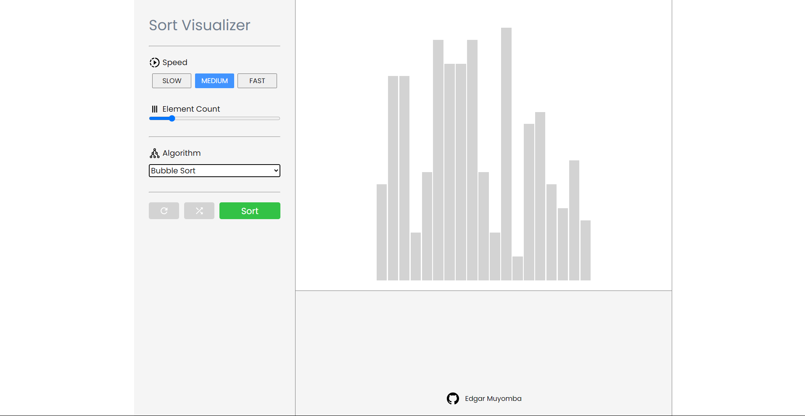

# Sort Visualizer
A simple react application to visualize sorting algorithms. Current implementations include [bubble sort](https://en.wikipedia.org/wiki/Bubble_sort), [insertion sort](https://en.wikipedia.org/wiki/Insertion_sort) and [selection sort](https://en.wikipedia.org/wiki/Selection_sort).



## How to setup dev
1. Clone the repository
   ```
   git clone <url>
   ```
2. Install dependencies
   ```
   npm install
   ```
3. Run the server
   ```
   npm run dev
   ```
The project will be live on localhost port `5173`

## Development Tools
- Typescript
- Scss
- React